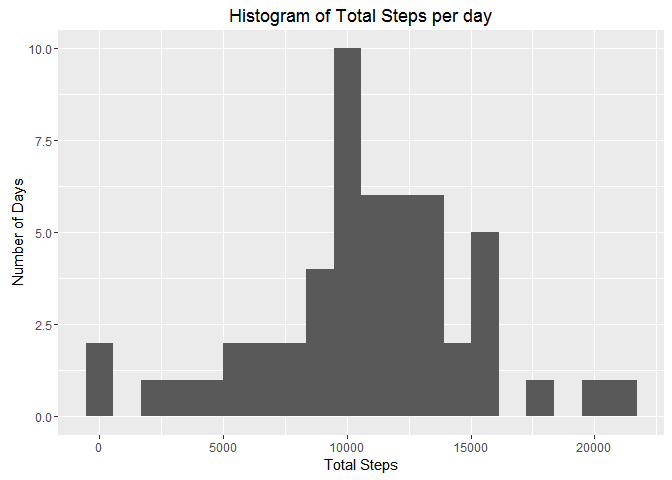

# Reproducible Research: Peer Assessment 1


## Loading and preprocessing the data
The first step in the project is to load data using the following R code:


```r
        setwd("repdata_data_activity")
        rawdata<-read.csv("activity.csv")
        
        ## Turn off scientific notation
        options(scipen=999)
```

## What is mean total number of steps taken per day?
The first analysis we will undertake looks at the data on a daily basis. This part of the assignment ignores missing values in the dataset.

First, we will use ddply to calculate the total steps taken each day, and then determine the mean of this value.

### Total number of steps taken per day

```r
## 1. Calculate the total number of steps taken per day
        library("plyr",quietly=TRUE)
```

```
## Warning: package 'plyr' was built under R version 3.2.5
```

```r
        library("dplyr",quietly=TRUE) 
```

```
## Warning: package 'dplyr' was built under R version 3.2.5
```

```r
        steps<-rawdata %>%
                group_by(date) %>%
                summarize(total = sum(steps))
        meansteps<-mean(steps$total,na.rm=TRUE)
        meanstepsp<-prettyNum(meansteps,big.mark = ",")
```
The mean total steps taken each day is 10,766.19.  

### Histogram of total steps each day
Then we will use ggplot to generate a histogram showing how many days are within each of 10 buckets.

```r
## Make a histogram of the total number of steps taken each day
        library("ggplot2",quietly = TRUE)
```

```
## Warning: package 'ggplot2' was built under R version 3.2.5
```

```r
        ## remove NA values so that we don't get warning messages
        steps3<-steps[!is.na(steps$total),]
        
        ## Create plot
        g<-ggplot(steps3,aes(steps3$total)) +
                geom_histogram(bins = 20)+
                ggtitle("Histogram of Total Steps per day") +
                xlab("Total Steps") +
                ylab("Number of Days")
        print(g)
```

<!-- -->

### Mean and Median of total number of steps per day
Finally, we will calculate the median number of total steps per day.  
Note that the assignment asks for the mean, but we already did this above, so will just reuse that value.

```r
## Calculate and report the mean and median of the total number of steps taken per day

## we already computed the mean total number above, so just reusing that value
stepmedian1<-median(steps$total,na.rm = TRUE)
stepmedian1p<- prettyNum(stepmedian1,big.mark = ",") 
```
The mean number of steps taken per day ignoring missing values is: 10,766.19.  
The median number of steps taken per day ignoring missing values is: 10,765.  


## What is the average daily activity pattern?
In the second analysis, we will examine the data by 5 minute interval, rather than by day.

### 5-minute interval vs. avg number of steps, averaged across all days
This code will generate a plot of the 5-minute interveal vs. the average number of steps taken in the interval, averaged across all days.

```r
## Make a time series plot (i.e. type = "l") of the 5-minute interval (x-axis) and the average number of steps taken, averaged across all days (y-axis)
        library ("stringr",quietly = TRUE)
```

```
## Warning: package 'stringr' was built under R version 3.2.5
```

```r
        ## Create the data for the plot
        intervalsteps<- rawdata %>% 
                group_by(interval) %>%
                summarize(average = mean(steps,na.rm = TRUE))

        ## Create the plot
        g<-ggplot(intervalsteps,aes(interval,average)) + 
                geom_line() +
                ggtitle("Average Number of Steps per Interval") +
                ylab("Average Number of Steps")
        print(g)
```

<!-- -->

### Which 5-minute interval on average across all days in the dataset, contains
### the maximum number of steps?
This code will determine what interval has the most steps on average across all days in the dataset.

```r
maxstepsinterval<-intervalsteps[which(intervalsteps$average == max(intervalsteps$average,na.rm = TRUE)),1]
```
The interval on average across all days in the dataset that has the maximum number of steps is: 835


## Imputing missing values
According to the assignment, "... there are a number of days/intervals where there are missing values (coded as NA). The presence of missing days may introduce bias into some calculations or summaries of the data."

### Total number of missing values in the dataset
This code will determine the number of missing values in the dataset.

```r
missingvalues<-sum(is.na(rawdata$steps)) 
```
There are 2304 missing values in the dataset.

### Strategy for filling in missing values
Since the data is stored in terms of intervals, to remove possible skew due to missing values, the overall average number of steps for each interval will be used where there are no values stored.

### Create a new dataset with missing data filled in

```r
## overall average number of steps was calculated previously, and stored as intervalsteps

## make a copy so we don't mess up our raw data
wd<-rawdata

## This sets the NA's to the average based on the interval.
## This took longer than it should have, and probably can be done with apply.
for (n in 1:length(wd$steps)){
        if (is.na(wd[n,1])) {
                o<-which(intervalsteps$interval == wd[n,3])
                wd[n,1] = intervalsteps[o,2]
        }
}
```

### Histogram of total number of steps taken each day

```r
        ## Recalculate the total number of steps per day using Imputed Values for NA's
        impsteps<- wd %>%
                   group_by(date) %>%
                   summarize (total = sum(steps))
        
        ## Create plot
        g<-ggplot(impsteps,aes(impsteps$total)) +
                geom_histogram(bins = 20)+
                ggtitle("Histogram of Total Steps per day") +
                xlab("Total Steps") +
                ylab("Number of Days")
        print(g)
```

<!-- -->

### Mean & Median of total number of steps taken each day

```r
stepmean2<-mean(impsteps$total)
stepmedian2<-median(impsteps$total)
stepmean2p<-prettyNum(stepmean2,big.mark = ",")
stepmedian2p<-prettyNum(stepmedian2,big.mark = ",")
```
The mean number of steps taken per day accounting for missing values is: 10,766.19.  
The median number of steps taken per day accounting for missing values is: 10,766.19.  

### Comparison of values with and without missing values

```r
        diffmean <- stepmean2 - meansteps
        diffmedian <- stepmedian2 - stepmedian1
```
After replacing NA values with the average for that interval, the means did not change, and the median value increased slightly.  The mean increased by 0 steps, while the median increased by 1.1886792.  In addition by comparing the two histograms, it can be seen that the distribution of the total steps shifts to the right (more days with higher number of steps.)

## Are there differences in activity patterns between weekdays and weekends?
The final part of the assignment is to determine the difference in number of steps on weekdays and weekends.  For this part of the assignment we are using the data WITH imputed values.

```r
wd$day<-weekdays(as.POSIXct(wd$date))
wdays <- c("Monday","Tuesday","Wednesday","Thursday","Friday")
wd$wkdy <- factor((wd$day %in% wdays),levels=c(FALSE,TRUE),labels = c("Weekend","Weekday"))

wkdytotsteps<-wd %>%
                group_by(wkdy) %>%
                summarize(totsteps = sum(steps))
stepsperweekday<-wkdytotsteps[2,2]/5
stepsperweekendday<-wkdytotsteps[1,2]/2
weekenddiff<-stepsperweekendday-stepsperweekday
stepsperweekdayp<-prettyNum(stepsperweekday,big.mark = ",")
stepsperweekenddayp <- prettyNum(stepsperweekendday,big.mark = ",")
weekenddiffp<-prettyNum(weekenddiff,big.mark = ",")
```
On an average weekday, there are 92,302.63 steps taken, while on a weekend there are 97,612.19 steps taken.  This indicates that on average, activity on weekends increases by 5,309.562 steps.

## Panel Plot - Weekdays vs. Weekends

```r
g<-ggplot(wd,aes(interval,steps)) +
        geom_line() +
        facet_grid(wkdy~.) +
        ggtitle("Number of Steps per Interval - Weekends vs. Weekdays") +
        xlab("Interval")+
        ylab("Number of Steps")
print(g)
```

<!-- -->
